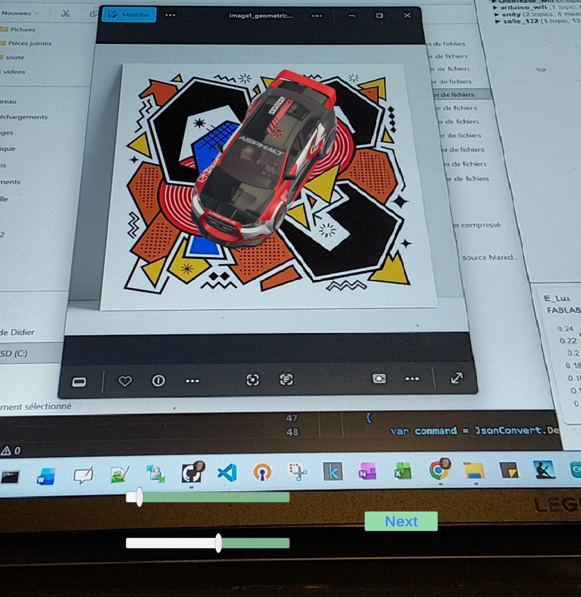
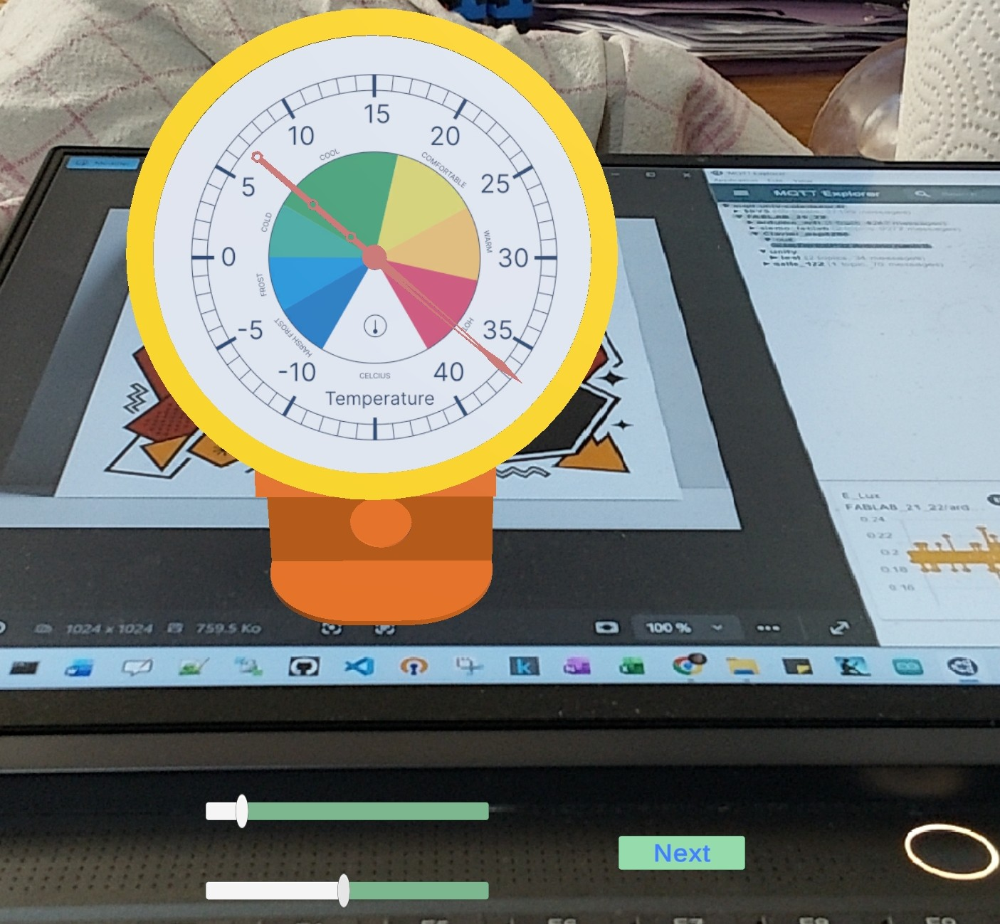

# ARImageTrackingSlider_2
unity 6.3 ARfoundation 6.3 slider mqtt

pour commander la rotation par MQTT ,....  : 
{
  "scale": 5,
  "rot": 40,
  "temperature": 25.0
}

sur le topic :  FABLAB_21_22/unity/test/in

